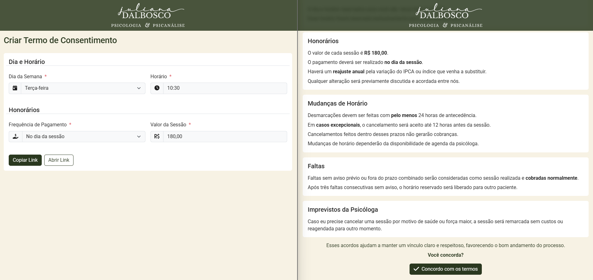

# Termos de Consentimento para Sessão de Psicologia

Este projeto é um app desenvolvido para a psicóloga Juliana Dalbosco, utilizando Angular com geração de site estático (SSG - Static Site Generation) e publicado no GitHub Pages.



## Tecnologias Utilizadas

- **Angular**: Framework de desenvolvimento web utilizado para construir a interface do usuário.
- **GitHub Pages**: Serviço de hospedagem utilizado para publicar o site.
- **Microsoft Clarity**: Ferramenta de análise de comportamento do usuário que fornece visões detalhadas sobre a interação dos visitantes com o site.

## Páginas

- **Cadastro**: Página de uso exclusivo da Psicóloga, para preencher dados específicos para cada paciente.
- **Visualização**: Visualização do paciente, com o link gerado pela psicóloga no cadastro do termo de consentimento.

## Como Rodar o Projeto Localmente

- **Clone o repositório**:

```sh
  git clone https://github.com/leonardomnds/julianadalboscopsi.git
  cd julianadalboscopsi
```

- **Instale as dependências**:

```sh
  npm install
```

- **Rodar o servidor de desenvolvimento**:

```sh
  npm run serve
```

- **Acesse o site**:

  Abra o navegador e vá para [http://localhost:4200](http://localhost:4200).

## Como Gerar o Site Estático

```sh
  npm run build
```

## Publicação no GitHub Pages

- **Instale o pacote `angular-cli-ghpages`**:

```sh
  npm install -g angular-cli-ghpages
```

- **Faça o deploy para o GitHub Pages**:

```sh
  npm run deploy
```

- **Acesse o site**:

  Abra o navegador e vá para [https://termos.julianadalboscopsi.com.br/novo](https://termos.julianadalboscopsi.com.br/novo).

## Microsoft Clarity

Este projeto utiliza **Microsoft Clarity** para obter visões detalhadas sobre como os visitantes interagem com o site. Clarity oferece funcionalidades como:

- **Mapas de calor**: Visualização das áreas mais clicadas e visualizadas pelos usuários.
- **Sessões gravadas**: Gravações das sessões dos usuários para entender melhor seus comportamentos e dificuldades.
- **Análise detalhada**: Dados sobre a interação dos usuários, ajudando a identificar oportunidades de melhoria na experiência do usuário.

Para integrar o Microsoft Clarity ao projeto, siga os passos descritos na [documentação oficial](https://clarity.microsoft.com/).

## Licença

Este projeto está licenciado sob a licença MIT. Veja o arquivo [LICENSE](LICENSE) para mais detalhes.
